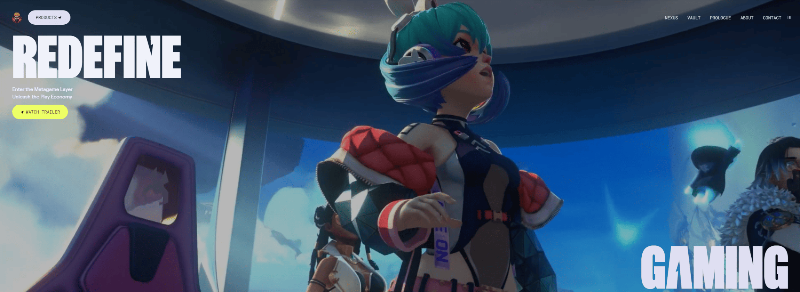

<div align="center">
  <div>
    
    
    
  </div>
  <h3 align="center">An Awwwards Winning Website</h3>
</div>

## 📋 Table of Contents

1. 🤖 [Introduction](#introduction)
2. ⚙️ [Tech Stack](#tech-stack)
3. 🔋 [Features](#features)
4. 🤸 [Quick Start](#quick-start)
5. 🚀 [Deploy](#deploy)

## ⚠️ Disclaimer

All design credits go to **[Zentry](https://zentry.com/)**. This project is created purely for **educational purposes** and is not intended for commercial use or public deployment.

## <a name="introduction">🤖 Introduction</a>

This project is a visually stunning website inspired by **[Zentry](https://zentry.com/)**, designed to showcase the cutting-edge web design techniques that define an Awwwards-winning experience. With scroll-triggered animations, geometric transitions, and immersive video storytelling, the project delivers a modern, luxurious feel.

The primary goal is to demonstrate advanced UI/UX principles, dynamic interactions, and seamless responsiveness while learning and developing the project. It serves as both a practical exploration of GSAP and a showcase of modern web design practices.

**Explore live site** [](https://awwward-zentry.vercel.app/)

## <a name="tech-stack">⚙️ Tech Stack</a>

- GSAP: For high-performance animations.
- React.js: As the core JavaScript library for building user interfaces.
- Tailwind CSS: For rapid and efficient styling.

## <a name="features">🔋 Features</a>

👉 **Scroll-Based Animations**: Create dynamic and engaging user experiences triggered by scrolling.

👉 **Clip Path Animations**: Utilize CSS clip-paths for unique geometric transitions.

👉 **3D Hover Effects**: Add interactivity with modern 3D transformations.

👉 **Video Transitions**: Seamlessly integrate video elements to enhance storytelling.

👉 **Smooth UI/UX**: Deliver intuitive, polished, and responsive interfaces.

👉 **Fully Responsive Design**: Ensure consistent experiences across all devices.

Additional highlights include a modular codebase and reusable components for better maintainability.

## <a name="quick-start">🤸 Quick Start </a>

Follow these steps to set up the project locally on your machine.

**Prerequisites**

Ensure the following are installed on your system:

- [Git](https://git-scm.com/)
- [Node.js](https://nodejs.org/en)
- [npm](https://www.npmjs.com/) (Node Package Manager)

**Cloning the Repository**

```bash
git clone git@github.com:roshanbist/awwward-zentry.git
cd awwward-zentry
```

**Installation**

Install the project dependencies using npm:

```bash
npm install
```

**Running the Project**

```bash
npm run dev
```

Open [http://localhost:5173](http://localhost:5173) in your browser to view the project.

## <a name="deploy">🚀 Deploy</a>

The project is deployed using Vercel. You can explore the live demo here: [Demo](https://awwward-zentry.vercel.app/)
